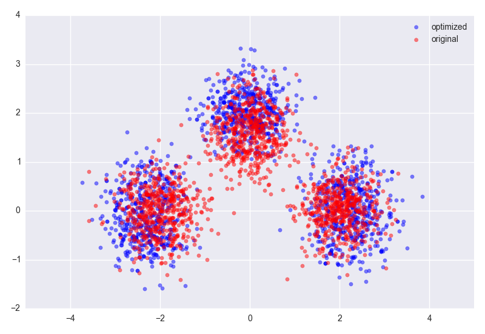

# Code for "Infant-directed speech is consistent with teaching"


This is the code used to generate data in the paper 

Eaves, B., Feldman, N., Griffiths, T., & Shafto, P. (2016) Infant-directed speech is consistent with Teaching. *Psychological Review*


## Insallation
The installation proceedure has been tested only on Mac OSX Yosimite. Requires python 3. You can install python3x with [homebrew](http://brew.sh/)

    $ brew update
    $ brew install python3

Install virtual environment, virtual environment, and create a virtual environment. This allows you to keep the python packages required for this software.

```bash
$ sudo pip install virtualenv
$ sudo pip install virtualenvwrapper
$ mkvirtualenv --python=`which python3.3` ids
(ids)$
```

To use this code in the future you need only type the following command

```bash
$ workon ids
```
### Requirements (OSX)

For the C++ parts you will need the [Armadillo linear algebra libraryy](http://arma.sourceforge.net/download.html). You can install it with [homebrew](http://brew.sh/). 

**Note**: Homebrew installs are not specific to the virtual environment. If you have a version of armadillo installed (you would know if you did), this will create a symbolic link that may break compile processes for other code you have.

```bash
$ brew update
$ brew install armadillo
```

### Install.
From inside the virtual environment navigate to the main directory (the directory with this readme)
```bash
(ids)$ python setup.py install
```
Or if you intend to edit the source:

```bash
(ids)$ python setup.py develop
(ids)$ export PYTHONPATH=$PYTHONPATH:`pwd`
```

You should be good-to-go now.

### Testing (you should *really* do this before you run anything)
To run tests of the python code

```bash
(ids)$ cd ids_teach/tests
(ids)$ py.test

```

To run (ad-hoc) tests of the C++ code:

```bash
(ids)$ cd cpp
(ids)$ make runtest
```

## Use

`main.py` is your entry point to all pre-built analyses. To run a simple example on toy data:

```bash
(ids)$ python main.py --example
```

### Reproducing the paper analyses
**NOTE**: The data used in the paper is included in the repository so that users can quickly reproduce analyses.

To recreate the original paper figures:
```bash
(ids)$ python main.py --paperfigs  # using default data
```

### General use (generate a teaching set from an arbitrary target model)

An example can be found in `main.py`.
####Step 1. Specify a target model
```python
from idsteach import utils
from idsteach.teacher import Teacher
from idsteach.models import NormalInverseWishart
import numpy as np

# triangle
cov_a = np.eye(2)*.2
cov_b = np.eye(2)*.2
cov_c = np.eye(2)*.2
mean_a = np.array([-2.0, 0.0])
mean_b = np.array([2.0, 0.0])
mean_c = np.array([0.0, 1.6])

target_model = {
    'd': 2,
    'parameters': [
        (mean_a, cov_a),
        (mean_b, cov_b),
        (mean_c, cov_c),
        ],
    'assignment': np.array([0, 1, 2], dtype=np.dtype(int)) # one data point per component
}
```

####Step 2. Set up a data model by specifying a prior
```python
prior = {
        'nu_0': 3,
        'kappa_0': 1,
        'mu_0': np.zeros(2),
        'lambda_0': np.eye(2)*.5
    }

data_model = NormalInverseWishart(**prior)
```

...or alternatively alternatively, let `NormalInverseWishart` build its own vague prior from the target model...

```python
data_model = NormalInverseWishart.with_vague_prior(target_model)
```

####Step 3. Create a `Teacher` and run the sampler
```python
n = 500
t = Teacher(target_model, data_model, crp_alpha=1.0, t_std=1, fast_niw=True)
t.mh(n, burn=500, lag=10, plot_diagnostics=False)
```

####Step 4. Get the data and visualize
```python
X_orig = np.vstack((np.random.multivariate_normal(mean_a, cov_a, n),
                    np.random.multivariate_normal(mean_b, cov_b, n),
                    np.random.multivariate_normal(mean_c, cov_c, n)))
X_opt, _ = t.get_stacked_data()

#plot
plt.figure(tight_layout=True, facecolor='white')
plt.scatter(X_opt[:, 0], X_opt[:, 1], color='blue', alpha=.5, label='optimized')
plt.scatter(X_orig[:, 0], X_orig[:, 1], color='red', alpha=.5, label='original')
plt.legend(loc=0)
plt.show()
```

You should see something like this (this figure demonstrates both hyperarticulation and variance increase):

